# Pokédex con JavaScript

**Autor:** Carlos Marrero Martin

## Descripción
Pokédex que consulta PokéAPI y muestra los 151 Pokémon de la primera
generación en tarjetas. Permite buscar por nombre, número o fragmento,
filtrar por tipo y consultar los detalles de cada Pokémon.

## Tecnologías utilizadas
HTML, CSS y JavaScript puro (sin frameworks ni librerías). Datos de
[PokéAPI](https://pokeapi.co/).

## Cómo ejecutarla
1. Clona el repositorio: `git clone https://github.com/TU_USUARIO/pokedex.git`
2. Abre la carpeta `pokedex`.
3. Abre `index.html` en el navegador (o con la extensión Live Server de VS Code).
4. Pulsa **Cargar los 151 Pokémon**. Hace falta conexión a internet.

## Estructura del proyecto
```text
pokedex/
├── index.html
├── css/
│   └── style.css
├── js/
│   ├── app.js
│   └── Pokemon.js
└── assets/
    ├── images/
    └── readme/

```
## Funcionalidades implementadas
- Carga de los 151 Pokémon desde PokéAPI.
- Tarjetas con número, nombre, tipos, altura y peso.
- Cambio de sprite trasero/frontal al pasar el cursor, sin peticiones nuevas.
- Búsqueda por nombre, número y fragmento.
- Filtro por tipo, combinable con la búsqueda.
- Panel de detalles con experiencia base, habilidades y estadísticas.
- Gestión de estados de carga, sin resultados y errores, con reintento.
- Diseño adaptable a móvil y escritorio.

## Ampliaciones voluntarias
- Barras visuales para las estadísticas.

## 1. Punto de partida

### Descripción

La mini-Pokédex de la práctica guiada permite buscar un Pokémon por nombre
o número y muestra una tarjeta con su imagen, número, altura, peso y tipos,
consultando PokéAPI con `fetch`.

### Estructura inicial

```text
pokedex/
├── index.html
├── css/
│   └── style.css
└── js/
    └── app.js
```

### Funcionalidades ya implementadas

- Búsqueda por nombre o número (sin importar mayúsculas ni espacios).
- Tarjeta generada dinámicamente con JavaScript.
- Mensaje de carga y botón desactivado durante la consulta.
- Validación de campo vacío y error controlado si el Pokémon no existe.

### Pruebas realizadas

| Prueba | Resultado |
|---|---|
| La página carga correctamente | ✅ |
| Búsqueda por nombre (`pikachu`) | ✅ |
| Búsqueda por número (`25`) | ✅ |
| La información aparece en pantalla | ✅ |
| Error mostrado con mensaje comprensible | ✅ |
| Sin errores en consola en uso normal | ✅ (el 404 de un Pokémon inexistente lo registra el navegador, no es un error del código) |

### Capturas

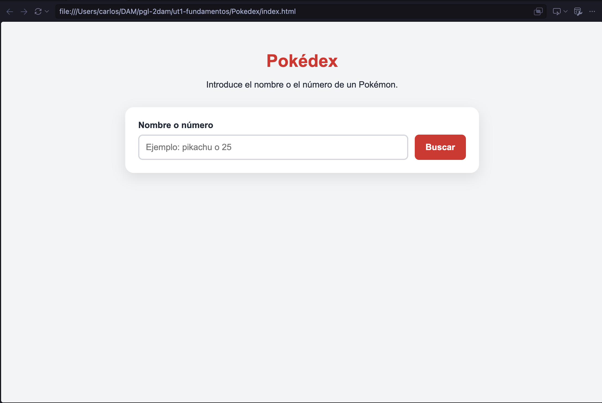
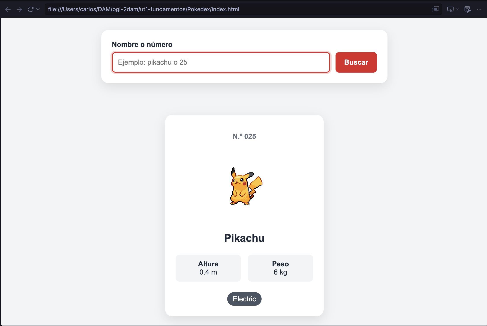
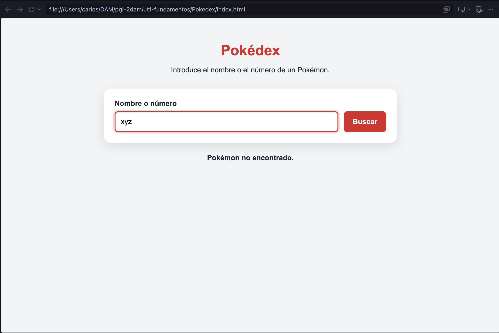

### Commit de partida

[c8dac13](https://github.com/CarlosMarreroM/pgl-2dam/commit/c8dac13a4923e0f30415584566a0b5577371ebac)

## 2. Carga de los 151 Pokémon

### Cambios respecto al código inicial

- Nuevo archivo `js/Pokemon.js` con la clase `Pokemon`.
- Botón "Cargar los 151 Pokémon" en `index.html`.
- `obtenerPokemon` ahora devuelve un objeto `Pokemon`.
- Nueva función `obtenerTodos` que consulta los ids del 1 al 151.

### Consulta y transformación de datos

Con `fetch` hago la petición a `https://pokeapi.co/api/v2/pokemon/{id}` y
con `respuesta.json()` convierto la respuesta en un objeto de JavaScript.
Ese objeto trae muchísimos datos, así que en la clase `Pokemon` solo me
quedo con los que necesito: id, nombre, sprites, tipos, altura, peso,
experiencia base, habilidades y estadísticas.

La API da la altura en decímetros y el peso en hectogramos, por eso los
divido entre 10 para tener metros y kilogramos (por ejemplo, Pikachu
mide `4` dm → 0,4 m y pesa `60` hg → 6 kg).

Para cargar los 151 creo un array con 151 peticiones y las lanzo todas a la
vez con `Promise.all`. Aunque unas respondan antes que otras, `Promise.all`
devuelve los resultados en el mismo orden en que puse las peticiones, así
que la lista queda siempre del 1 al 151. Si falla una sola, falla todo y se
muestra el mensaje de error.

### Capturas

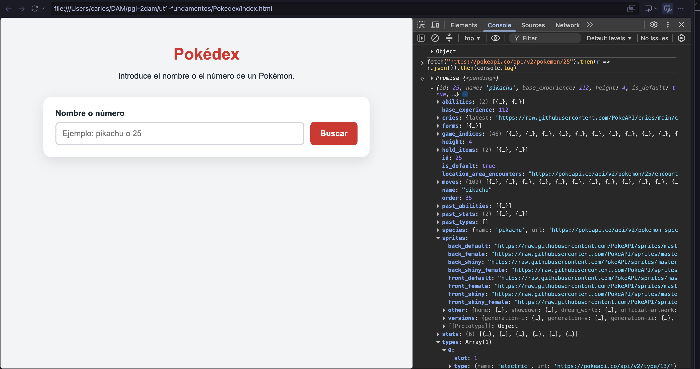
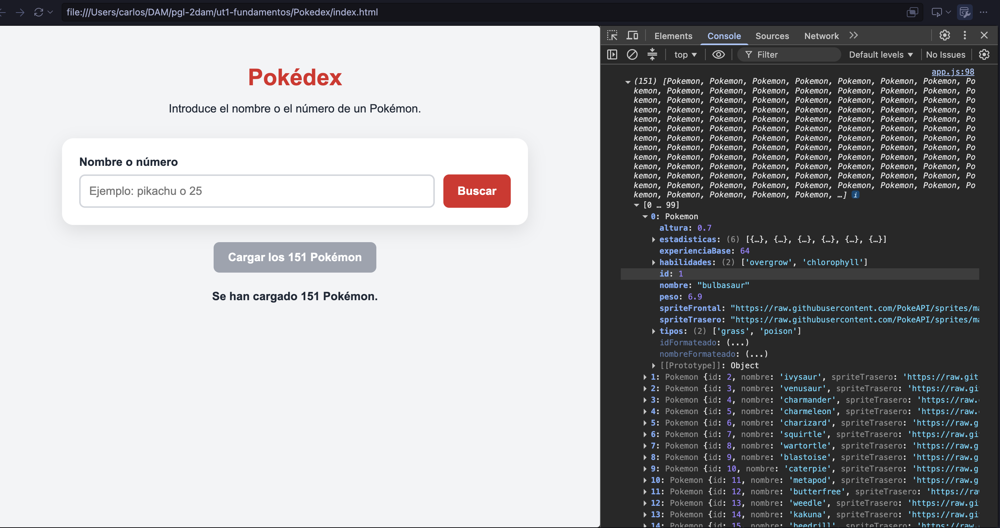
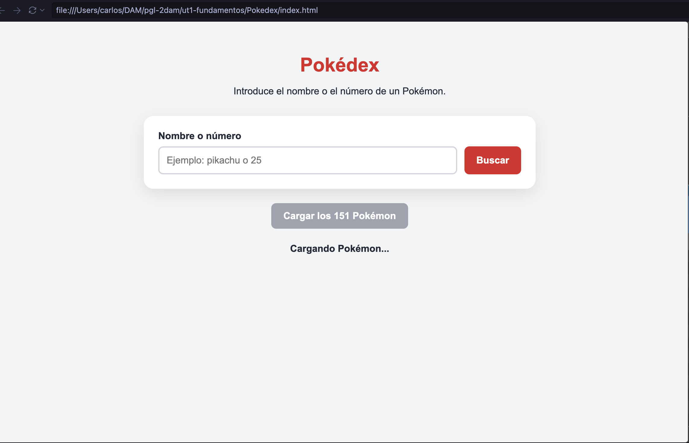
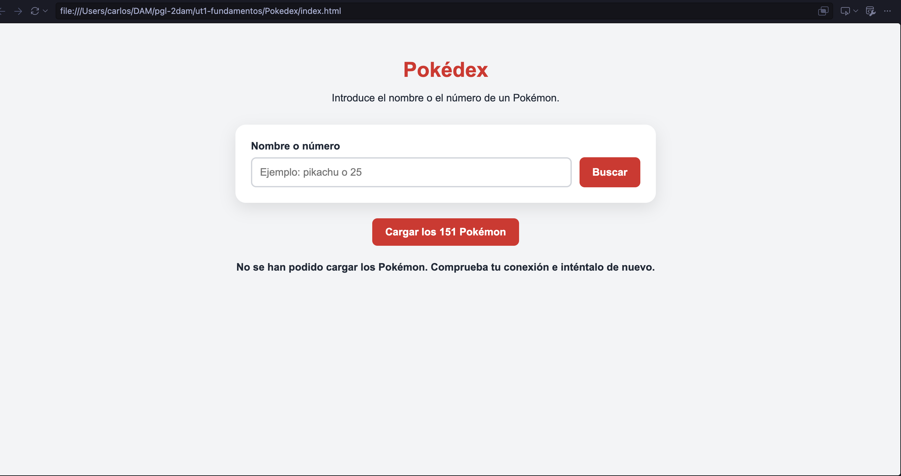
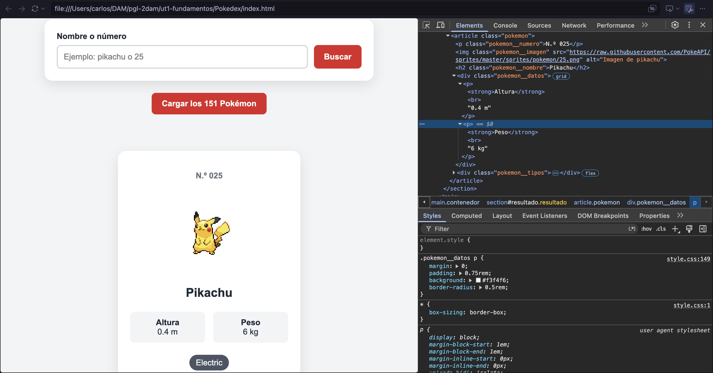

## 3. Construcción de las tarjetas

### Datos seleccionados de PokéAPI

De cada Pokémon uso estos datos:

- `id`, que se muestra con tres cifras (`001`) usando `padStart`.
- `name`, con la primera letra en mayúscula.
- Los sprites `back_default` (de espaldas) y `front_default` (de frente).
- Los tipos, sacados de `types`.
- La altura en metros y el peso en kilogramos (ya convertidos).

### Generación dinámica de las tarjetas

`crearTarjetaHTML` recibe un Pokémon y devuelve un string con el HTML de su
tarjeta (número, imágenes, nombre, tipos y medidas). `mostrarTarjetas`
recorre la lista con `map` para crear una tarjeta por Pokémon, las une con
`join("")` en un solo texto y lo mete en el contenedor con `innerHTML`.
Así se pintan las 151 de una vez.

### Cambio entre sprite trasero y frontal

Cada tarjeta lleva las dos imágenes a la vez. Por defecto el CSS solo
muestra la de espaldas, y al pasar el cursor por encima (`:hover`) oculta
esa y muestra la frontal. Como las dos imágenes ya están en la página, no se
hace ninguna petición nueva al pasar el ratón y el cambio es instantáneo.

### Cuadrícula adaptable

La cuadrícula usa `repeat(auto-fill, minmax(min(100%, 200px), 1fr))`.
`minmax` hace que cada tarjeta mida como mínimo 200px y como máximo lo que
quede libre, y `auto-fill` mete tantas columnas como quepan. Así se adapta
sola al ancho de la pantalla sin necesidad de media queries. El `min(100%,
200px)` evita que en pantallas muy estrechas la tarjeta se salga.

### Capturas

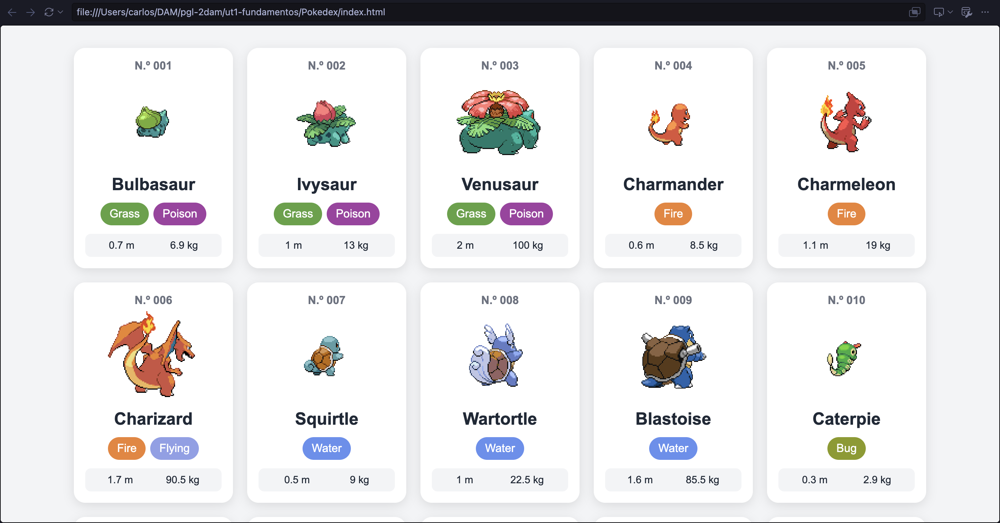
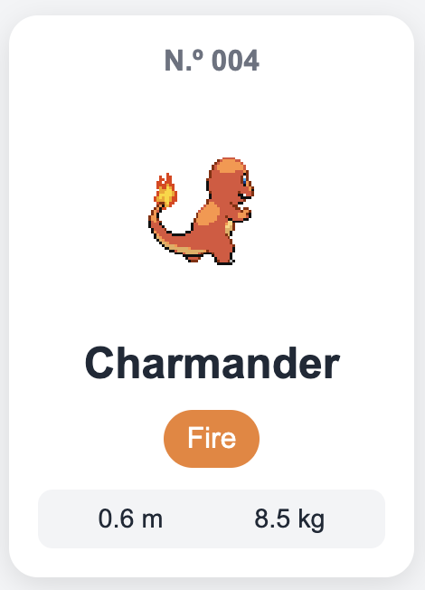
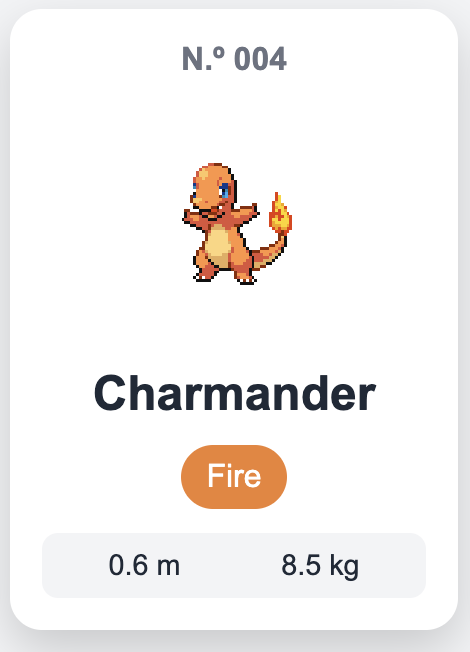
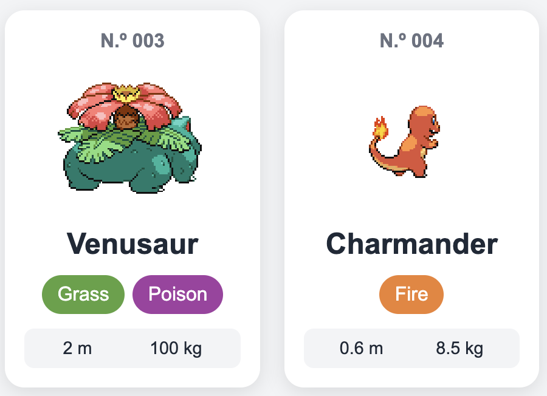
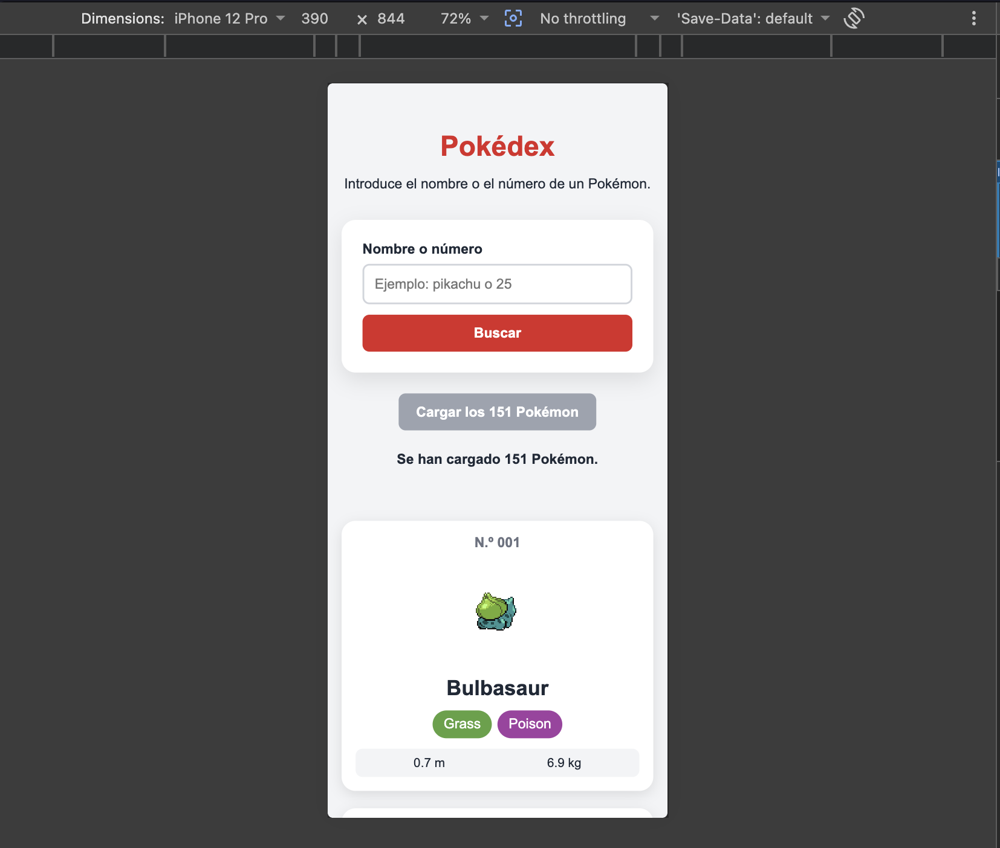

## 4. Barra de búsqueda y filtros

### Funcionamiento de la búsqueda
Primero normalizo lo que escribe el usuario con `trim()` y `toLowerCase()`,
así da igual poner espacios o mayúsculas. Después hay dos casos:

- Si el texto son solo dígitos (lo compruebo con la expresión regular
  `/^\d+$/`), busco el Pokémon con ese número exacto.
- Si no, busco el texto como fragmento del nombre con `includes`. Por
  ejemplo, `char` encuentra a Charmander, Charmeleon y Charizard.

La lista se filtra en vivo con el evento `input`, es decir, se actualiza
cada vez que escribo una letra. El evento `submit` del formulario (botón
Buscar o Enter) hace lo mismo, con `preventDefault()` para que la página no
se recargue.

### Filtro por tipo
Las opciones del selector no las escribí a mano, se generan con los datos
cargados en `rellenarSelectorTipos`:

1. `flatMap` junta los tipos de todos los Pokémon en una sola lista.
2. `new Set(...)` elimina los repetidos.
3. `sort()` los ordena alfabéticamente.

Con eso creo un `<option>` por cada tipo, más la opción "Todos". El filtro
se aplica con el evento `change` del selector.

### Combinación de ambos filtros
Todo está en una única función, `filtrarPokemons`, que lee a la vez el
cuadro de texto y el selector de tipo y usa `filter` con las dos condiciones
unidas por `&&`. Un Pokémon solo se muestra si cumple las dos. Si un
control está vacío, su condición da siempre `true` y no filtra nada.
Por ejemplo, `char` + tipo `fire` deja solo a los Charmander y compañía.
Después `actualizarVista` pinta las tarjetas y muestra cuántos se ven
("Mostrando X de 151") o un aviso si no hay resultados.

### Conservación de funcionalidades anteriores
La búsqueda por nombre o número de la práctica guiada sigue funcionando
(`25` y `pikachu` encuentran a Pikachu), pero ahora filtra los datos que ya
están cargados en el array `pokemons`, así que no hace peticiones nuevas a
la API. Por eso el buscador y el selector están desactivados hasta que se
pulsa "Cargar los 151 Pokémon".

### Problemas encontrados y soluciones
- **El 25 también encontraba el 125:** con `includes` sobre el número, al
  buscar `25` salían también el 125. Lo solucioné comparando el id de forma
  exacta cuando el texto son solo dígitos.
- **Controles antes de cargar:** si se buscaba antes de cargar los Pokémon
  no había nada que filtrar, así que desactivo el buscador y el selector
  hasta que la carga termina bien.

### Capturas
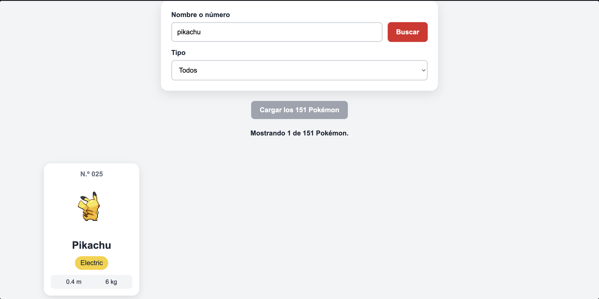
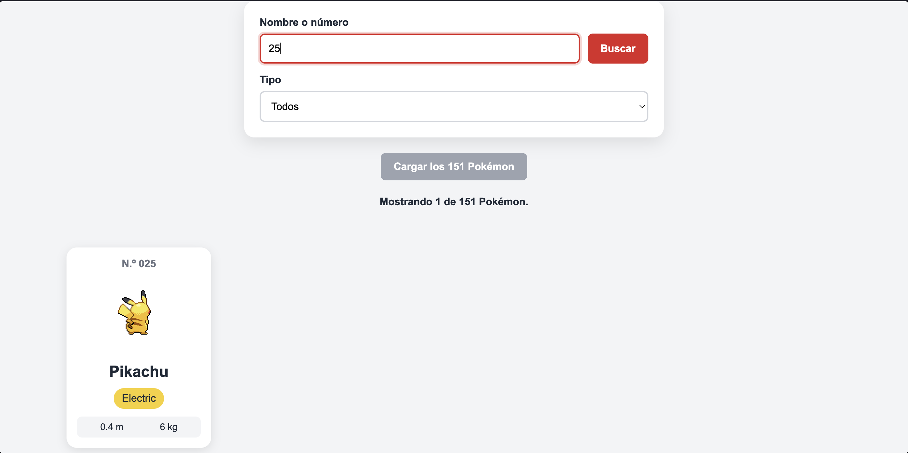
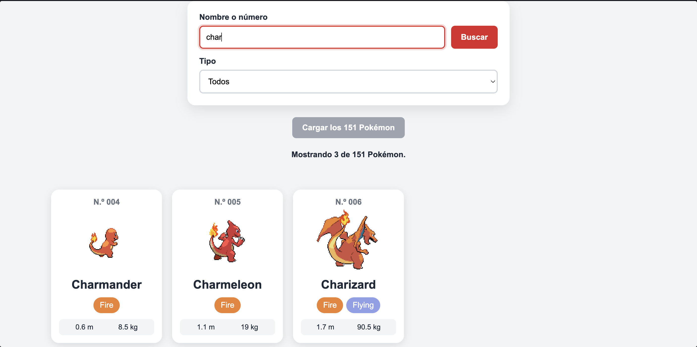
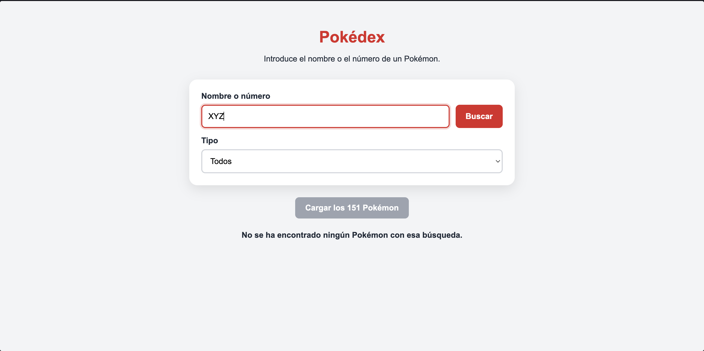
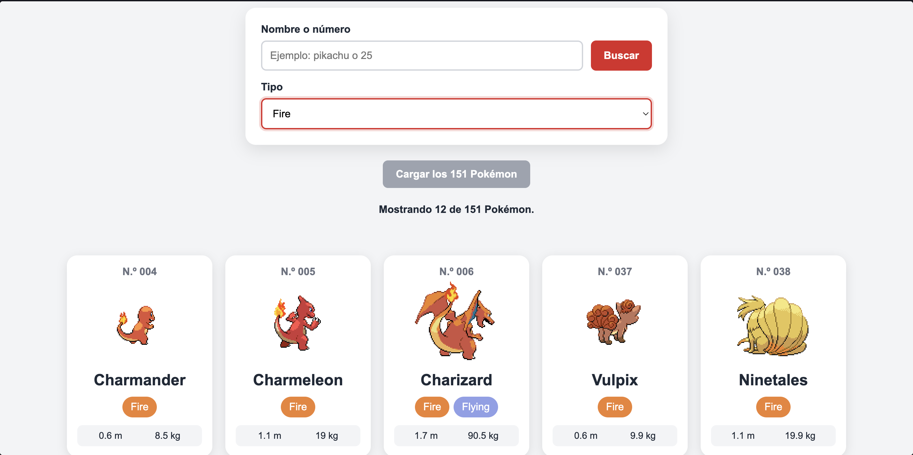
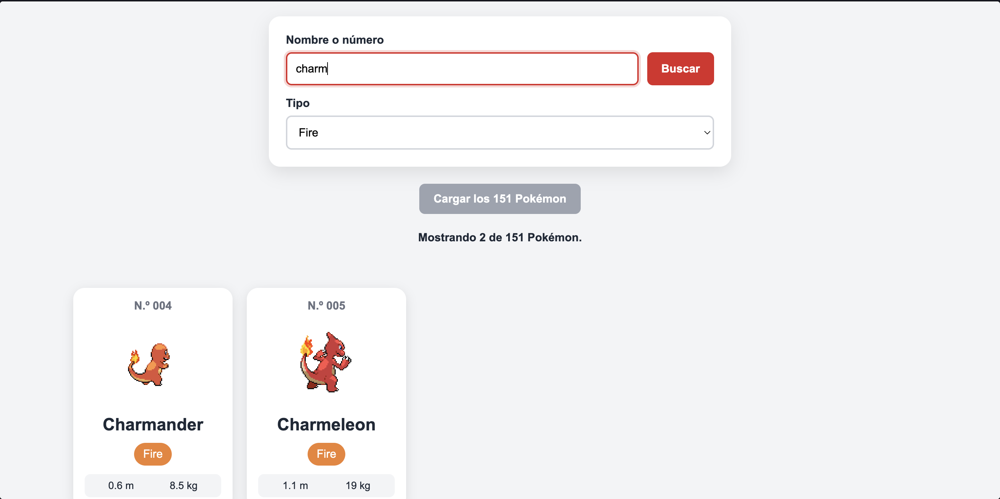
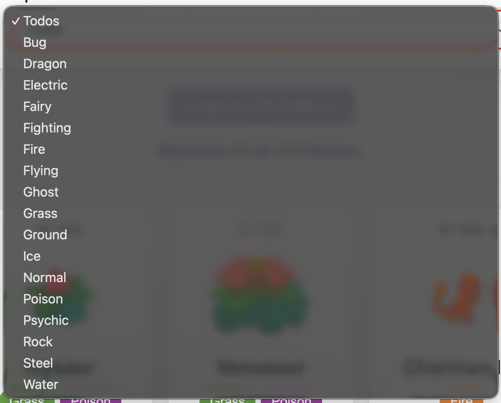

## 5. Información ampliada

### Panel de detalles
Para el panel uso la etiqueta `<dialog>` de HTML. Al llamar a
`showModal()` se abre encima de la página, con el fondo oscurecido
(`::backdrop`) y sin poder pulsar lo que hay detrás. Se puede cerrar de tres
formas:

- Con el botón ✕ de la esquina, que llama a `close()`.
- Pulsando en el fondo oscuro fuera del panel (compruebo que el clic ha sido
  sobre el propio `<dialog>`).
- Con la tecla Escape, que ya funciona sola con `showModal()`.

### Datos adicionales mostrados
Además de lo que ya salía en la tarjeta, el panel muestra:

- **Experiencia base**, que viene de `base_experience`.
- **Habilidades**, que vienen de `abilities`. Les quito los guiones y les
  pongo la primera letra en mayúscula.
- **Estadísticas base**, que vienen de `stats` (vida, ataque, defensa,
  ataque especial, defensa especial y velocidad), con los nombres traducidos
  al español.

Estos datos ya los guardaba la clase `Pokemon` desde la fase 2, así que no
hace falta ninguna petición nueva.

### Cómo se sabe qué Pokémon se abre
Cada botón "Ver detalles" lleva el id del Pokémon en un atributo
`data-id`. En vez de poner un evento a cada uno de los 151 botones, pongo
uno solo en el contenedor de las tarjetas (delegación de eventos). Cuando se
hace clic, `closest(".tarjeta__boton")` comprueba si se ha pulsado un botón,
leo su `data-id` y busco ese Pokémon en el array `pokemons` con `find`. Así
también funciona con las tarjetas que se vuelven a crear al filtrar.

### Ampliación voluntaria
Barras visuales para las estadísticas. El ancho de cada barra es el valor
de la estadística entre 255 (el máximo posible) en porcentaje, con un tope
del 100 %.

### Problemas encontrados y soluciones
- **Página que se movía con el panel abierto:** bloqueo el scroll del fondo
  mientras hay un `<dialog>` abierto (`body:has(dialog[open])`).

### Capturas
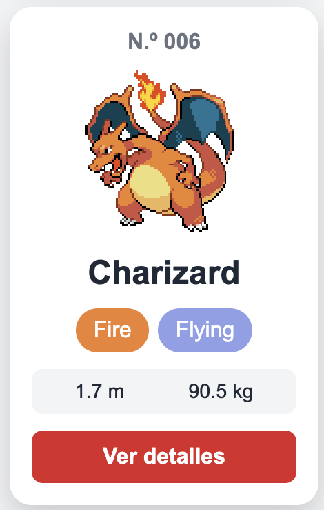
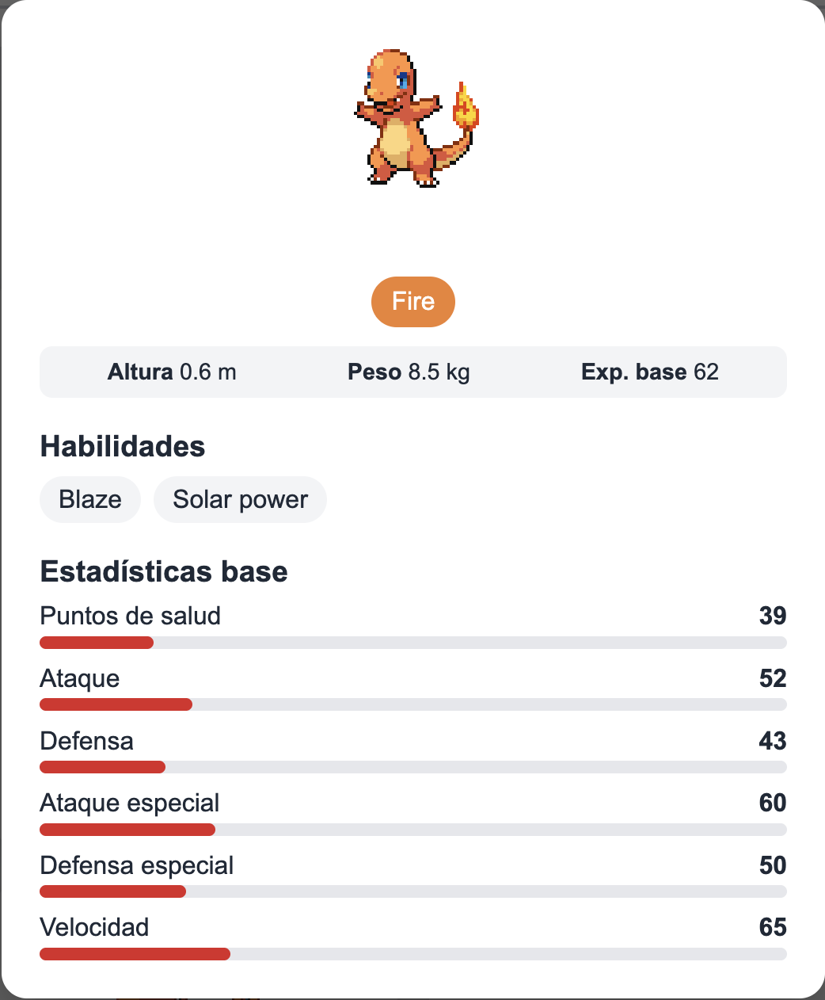
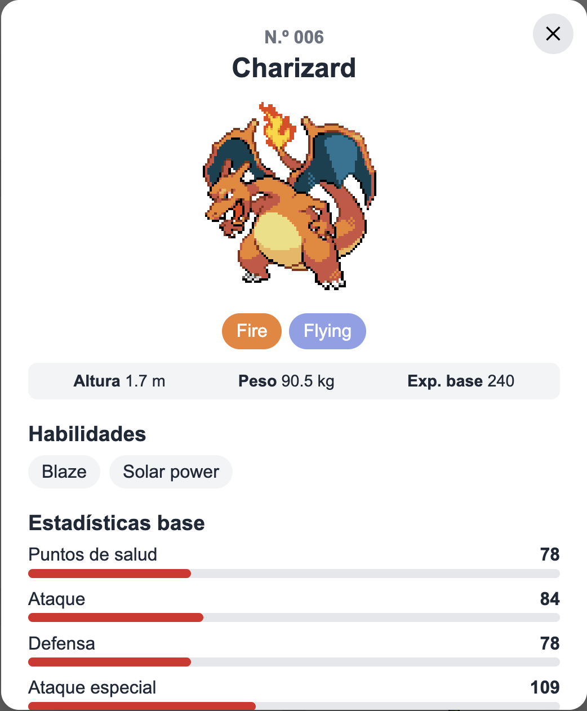
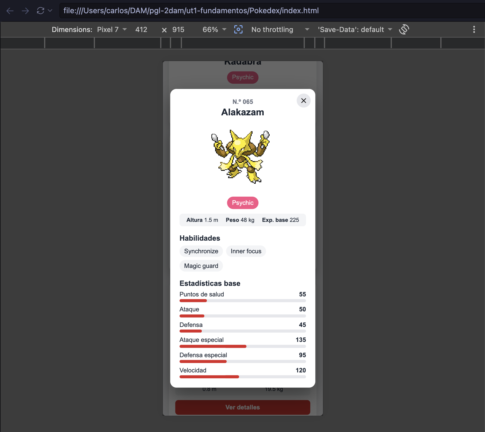

## 6. Gestión de estados y errores

### Estados contemplados
| Estado | Qué ve el usuario |
|---|---|
| Preparada para comenzar | "Pulsa «Cargar los 151 Pokémon» para empezar." y controles bloqueados |
| Cargando | "Cargando Pokémon..." y botón desactivado |
| Cargados | "Se han cargado 151 Pokémon." y controles activos |
| Sin resultados | "No se ha encontrado ningún Pokémon con esa búsqueda." |
| Error de comunicación | Mensaje explicativo y botón de carga activo para reintentar |

### Cómo se gestiona
Al pulsar el botón de carga, la petición va dentro de un `try/catch`. Antes
de empezar muestro "Cargando Pokémon..." y desactivo el botón para que no se
pueda pulsar dos veces. Si todo va bien, en el `try` relleno el selector de
tipos, pinto las tarjetas y activo el buscador y el filtro. Si algo falla,
el `catch` vacía la lista, muestra un mensaje explicando que se comprueben
la conexión y se vuelva a intentar, y reactiva el botón.

`Promise.all` es todo o nada: si falla una sola de las 151 peticiones, falla
la carga completa y se va al `catch`. Así nunca se queda una lista a medias.
El botón se reactiva solo en el error para poder reintentar. Si la carga va
bien no hace falta, porque ya están todos los Pokémon.

Cuando se filtra y no hay coincidencias, no es un error, sino un estado
más: se muestra el aviso "No se ha encontrado ningún Pokémon con esa
búsqueda.". Al abrir la página, el buscador y el selector están bloqueados
y se indica que hay que pulsar el botón para empezar.

## 7. Pruebas finales

| Prueba | Resultado |
|---|---|
| La página carga y muestra el mensaje inicial | ✅ |
| Los controles están bloqueados antes de cargar | ✅ |
| Se cargan los 151 Pokémon en orden | ✅ |
| Se muestra el estado "Cargando" | ✅ |
| Error de conexión con mensaje y reintento | ✅ |
| Búsqueda por nombre (`pikachu`) | ✅ |
| Búsqueda por número (`25`, sin devolver el 125) | ✅ |
| Búsqueda por fragmento (`char`) | ✅ |
| Búsqueda sin resultados | ✅ |
| Filtro por tipo | ✅ |
| Filtro por tipo combinado con la búsqueda | ✅ |
| Cambio de sprite al pasar el cursor | ✅ |
| Panel de detalles (abrir y cerrar de las tres formas) | ✅ |
| Diseño correcto en móvil | ✅ |

## 8. Conclusiones

### Dificultades encontradas
Lo que más me costó fue entender cómo funciona `Promise.all` y por qué los
resultados salen en orden aunque las peticiones terminen en momentos
distintos. También me costó la búsqueda por número, porque con `includes`
el 25 devolvía también el 125. Y tuve que usar la delegación de eventos
porque las tarjetas se vuelven a crear al filtrar y los botones perdían su
evento.

### Conocimientos adquiridos
- `fetch` y `async/await` para consultar una API y esperar la respuesta.
- `Promise.all` para lanzar muchas peticiones a la vez.
- `map`, `filter`, `flatMap` y `Set` para transformar y filtrar listas.
- Clases en JavaScript, con getters para formatear los datos.
- Delegación de eventos y atributos `data-*`.
- La etiqueta `<dialog>` para crear un panel modal.
- CSS Grid con `auto-fill` y `minmax` para una cuadrícula adaptable.
- Gestión de estados de carga, sin resultados y error.
